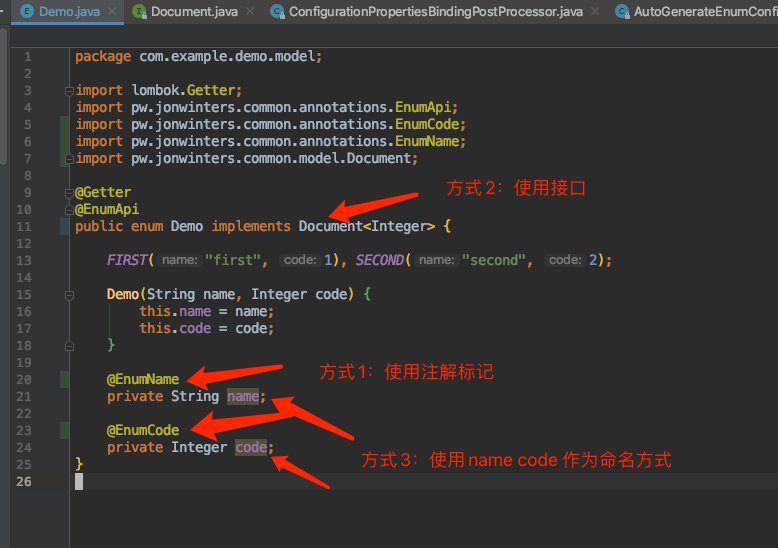

# AutoGenerateEnumApi 

#### 快速介绍
> AutoGenerateEnumApi是一个自动为Java枚举生成Rest接口的SpringBoot组件， 
> 组件默认采用约定而非配置的风格。自动化地生成接口的方式可以将你从重复繁琐的枚举接口编写工作中解放出来。  
> 当前端来找你要枚举定义的时候，你可以优雅地甩前端一巴掌，我们的枚举接口是自动生成的，  
> 你去Swagger文档里面好好找吧 🐕 :doge  

## 使用方法

#### 快速提示
> 我没有上传maven中央仓库，需要使用这个依赖的，请先在本地or私有maven库安装


1.在你的SpringBoot项目中加入依赖

```xml
  <dependency>
    <artifactId>auto-generate-enum-api-spring</artifactId>
    <groupId>pw.jonwinters.common</groupId>
    <version>1.0.1</version>
  </dependency>
```

2.在你的application.properties or yml文件中加入配置

```properties
enum.baseScanPackage=com.example
#你们公司的包名
enum.debug=true
#debug mode
enum.basePath=/enums
#所有枚举基目录
enum.debugPath=/tmp
#生成的RestController类的临时写入目录用于debug，默认是/tmp目录，不支持windows
```

3.在你的枚举类上使用如下图的方式标记字段




4.示例工程

https://github.com/jonwinters/auto-generate-enum-api-demo


## 后续开发

1.支持Swagger，暂时没精力支持了

2.更加灵活的配置